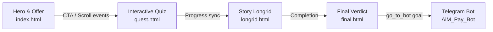

<p align="center">
  
</p>

<h1 align="center">AiM Bot Landing</h1>
<p align="center">Многошаговая воронка прогрева ML-курса: от хайпового лендинга до финального вердикта и лида в Telegram-боте.</p>

<p align="center">
  <a href="https://ai-bot-landing.vercel.app/" target="_blank">
    
  </a>
  <a href="https://t.me/AiM_Pay_Bot?start=me" target="_blank">
    
  </a>
</p>

<p align="center">
  
  
  
</p>

## Проект
- Бесшовная воронка из 4 страниц (лендинг → ML-квиз → storytelling longread → финальный тест) хранит состояние и отправляет лида в Telegram без серверного фронтенда.
- Прогрев управляется `AimQuestState` — мини-SDK, который синхронизует локальные шаги с API `https://aim-pay-bot-server.onrender.com` и умеет доклеивать query-параметры.
- Поведенческая аналитика: кастомные события, таймеры, счётчики прокрутки, funnel-метрики и телеметрия отправляются в Яндекс.Метрику.
- Светящийся UI в духе неонового киберпанка + Tailwind CDN + авторские шрифты Widock/Montserrat обеспечивают читабельность и чувство премиальности.

## Оглавление
1. [Продукт и сценарий](#продукт-и-сценарий)
2. [UI/UX и перформанс](#uiux-и-перформанс)
3. [Техническая архитектура](#техническая-архитектура)
4. [Воронка прогрева](#воронка-прогрева)
5. [Телеметрия и аналитика](#телеметрия-и-аналитика)
6. [Lighthouse и SEO](#lighthouse-и-seo)
7. [Структура проекта](#структура-проекта)

## Продукт и сценарий
AiM Bot Landing — это не просто лендинг. Это full-funnel прогрев, который переводит холодный трафик из рекламы к оплате через Telegram-бота. В основе — триггерная история «инженер ML на Уолл-стрит» с понятным CTA и постоянным сбором данных о поведении пользователя.



## UI/UX и перформанс
- **Визуальная система** — неоновые градиенты, стеклянные карточки и motion-анимации `cardy`, `pulse`, `floating`, прописанные прямо в `index.html` и `style.css`, создают премиальную атмосферу и удерживают внимание.
- **Адаптивность** — кастомные брейкпоинты на 1280, 880, 775, 575 px, динамический масштаб карточек и sticky CTA гарантируют идеальный UX на десктопе и телефонах.
- **Микровзаимодействия** — hover-эффекты, счётчики, таймер скидки на 72 часа, анимированные уведомления (`notification`, `progress-bar`, `crypto-card`) делают интерфейс «живым».
- **Скорость** — статические страницы, отсутствие сборщика, шрифты `font-display: swap` и ленивые скрипты позволяют держать 91 балл Performance и 92 балла SEO на Lighthouse (Chrome desktop).

## Техническая архитектура
- **Клиент без сборки**: четыре HTML-страницы + кастомные JS-модули (`main.js`, `app.js`, `longrid.js`, `final_app.js`, `state.js`) подключаются напрямую. Tailwind CDN (`tailwind.js`) предоставляет utility-классы без стадии build.
- **Слежение за состоянием**: `AimQuestState` в `state.js` хранит контекст лида в `localStorage`, синхронит прогресс с Render API и умеет правильно редиректить пользователя между экранами.

```66:173:state.js
async function saveProgress({ stage, stepKey, stepIndex, answer, meta }){
  const ctx = getContext();
  const createdAt = nowIso();
  const isSandbox = !ctx.leadId || String(ctx.leadId).trim() === '' || (new URL(window.location.href).searchParams.get('sandbox') === '1');
  const entry = { stage, step: stepKey, step_index: stepIndex ?? null, answer: answer ?? null, meta: meta ?? null, created_at: createdAt };
  if (isSandbox) { return entry; }
  upsertLocalProgress(entry);
  try {
    if (ctx.leadId) {
      await fetchJson(`${API}/form_warm/clients/${ctx.leadId}/progress`, {
        method: 'POST',
        headers: { 'Content-Type': 'application/json' },
        body: JSON.stringify({ stage, step: stepKey, step_index: stepIndex ?? null, answer })
      });
    }
  } catch (_){ /* tolerate offline */ }
  ...
}
```

- **Интерактив и аналитика**: `main.js` объединяет клики, scroll-depth, copy/select события и отправляет их во все доступные пиксели одной функцией `sendUserEvent`, а также крутит таймеры и FAQ-аккордеон.

```1:34:main.js
function sendUserEvent(eventName, params = {}) {
  if (window.gtag) gtag('event', eventName, params);
  if (window.fbq) fbq('trackCustom', eventName, params);
  if (window.ttq) ttq.track(eventName, params);
}
const scrollTracked = {25: false, 50: false, 75: false, 100: false};
window.addEventListener('scroll', () => {
  const docHeight = document.documentElement.scrollHeight - window.innerHeight;
  if (docHeight <= 0) return;
  const percent = Math.round((window.scrollY / docHeight) * 100);
  [25, 50, 75, 100].forEach(p => {
    if (!scrollTracked[p] && percent >= p) {
      sendUserEvent('scroll_' + p);
      scrollTracked[p] = true;
    }
  });
});
```

- **Маркетинговый urgency**: локальный таймер на скидку работает на всех визитах и повышает конверсию.

```142:170:main.js
(function() {
  const DURATION = 72 * 60 * 60 * 1000;
  const END_KEY = 'promoCountdownEnd';
  let endTime = localStorage.getItem(END_KEY);
  if (!endTime || isNaN(Number(endTime)) || Number(endTime) < Date.now()) {
    endTime = Date.now() + DURATION;
    localStorage.setItem(END_KEY, endTime);
  } else {
    endTime = Number(endTime);
  }
  ...
  updateCountdown();
})();
```

## Воронка прогрева
| Этап | Файл | Что происходит |
| --- | --- | --- |
| Хайповый лендинг | `index.html` + `main.js` | Герой с оффером + sticky CTA, счётчики, преимущества, FAQ, отзывы, Yandex.Metrika, Schema.org разметка, OG/Twitter карточки. |
| ML-квиз | `quest.html` + `app.js` | 10 шагов: 6 reveal-кейсов + 4 сегментирующих вопроса. Каждый клик сохраняется через API `form_warm/clients/:id/progress`, чтобы SDR видел ответы. |
| Story longrid | `longrid.html` + `longrid.js` | 15 карточек-чекпоинтов про построение ML-модели на Уолл-стрит. Прогресс фиксируется, есть micro-quiz внутри, прогрев строится на storytelling. |
| Финальный тест | `final.html` + `final_app.js` | 3 вопроса + персонализированный вердикт. По клику «Купить» шлётся goal `go_to_bot` в Метрику и редирект в Telegram бот. |

```72:229:app.js
const quizData = [...]; // 10 шагов
function renderStep(container, stepIndex, onDone) {
  ...
  if (item.type === 'choice') {
    btns.querySelectorAll('button').forEach(x => x.classList.remove('selected_button'));
    b.classList.add('selected_button');
    next.disabled = false;
    if  (indProgress == 7) sendProgress("7: Интерес к ML", opt)
    else if  (indProgress == 8) sendProgress("8: Готов изучать", opt)
    ...
  }
}
```

```8:325:longrid.js
const cards = [{ id:'conversation', ...}, ...]; // 15 этапов
renderCard({ card: cards[currentIndex], ... });
await window.AimQuestState.saveProgress({ stage:'longrid', stepKey: cards[currentIndex].id+':view', stepIndex: currentIndex, answer:null, meta:null });
document.getElementById('btnNext').addEventListener('click', async () => {
  ...
  if (currentIndex < total-1){
    currentIndex += 1;
    renderCard(...);
  } else {
    await window.AimQuestState.saveProgress({ stage:'longrid', stepKey:'completed', ... });
    const url = window.AimQuestState.buildUrl('final.html', leadId ? { lead_id: leadId } : {});
    window.location.href = url;
  }
});
```

```1:211:final_app.js
const quizData = [...]; // 3 вопроса
function renderStep(container, stepIndex, answers, onDone) {
  ...
  if (stepIndex >= quizData.length) {
    const score = calculateScore(answers);
    const verdict = getVerdict(score);
    sendProgress('final_score', score.toString());
    sendProgress('final_verdict', verdict.title);
    document.getElementById('buyFull').addEventListener('click', () => {
      if (window.ym) window.ym(window.YANDEX_METRIKA_ID, 'reachGoal', 'go_to_bot');
      window.location.href = 'https://t.me/AiM_Pay_Bot?start=me';
    });
  }
}
```

- **Lifecycle события** — `visibilitychange`, `beforeunload`, `selectionchange`, `copy`, `blink`, таймеры на 10/30/60 секунд, отслеживание формы и глубины скролла покрывают все главные точки касания.
- **Server-side telemetry** — каждый шаг квиза/лонгрида/финального теста пишется в Render API `form_warm/clients/:id/progress`, чтобы продавцы видели, на чём отвалился пользователь.

## Lighthouse и SEO
- Performance 91 / SEO 92 (Chrome 120, десктоп, кэш off).
- Что влияет на результат:
  - Ленивая загрузка встраиваемых скриптов, короткие критические стили, `font-display: swap`.
  - Богатая разметка: `Organization`, `Course`, `EducationalOccupationalProgram`, `FAQPage`, `BreadcrumbList`, OG/Twitter карты.
  - robots + sitemap, валидация домена для Pinterest, файлы для Google & Yandex.

## Структура проекта
```bash
.
├── index.html           # Главный лендинг
├── quest.html           # Квиз про мышление ML инженера
├── longrid.html         # Storytelling longread с прогрессом
├── final.html           # Финальный тест и CTA
├── main.js              # Общая аналитика, UI, таймеры
├── app.js               # Логика квиза
├── longrid.js           # Карточки чек-листа
├── final_app.js         # Финальный тест, вердикты
├── state.js             # SDK для сохранения прогресса
├── style.css            # Общая визуальная система
├── tailwind.js          # CDN билдер Tailwind
├── spec.md              # Формат событий Google Form
└── assets...            # иконки, шрифты, favicon, sitemap, robots
```
